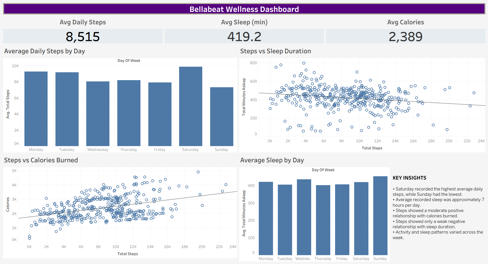

# Bellabeat Wellness Analysis

## Project Overview

This project analyzes Fitbit smart-device usage data to identify activity and sleep patterns and translate those findings into potential marketing and product opportunities for Bellabeat.

The analysis follows the Google Data Analytics Bellabeat case-study structure:

**Ask → Prepare → Process → Analyze → Share → Act**

## Business Questions

1. What trends can be identified in smart-device usage?
2. How could these trends apply to Bellabeat customers?
3. How could these trends influence Bellabeat's marketing strategy?

## Dataset

The project uses Fitbit Fitness Tracker data covering daily activity and sleep records.

For this analysis, the following files were used:

- `dailyActivity_merged.csv`
- `sleepDay_merged.csv`

The final merged analysis contains **410 activity-sleep records**.

## Tools Used

- Python
- Pandas
- Matplotlib
- Seaborn
- Tableau Public

## Data Preparation & Cleaning

The Python workflow includes:

- Loading activity and sleep datasets
- Checking dataset dimensions
- Checking missing values
- Checking and removing duplicate records
- Counting unique and common users
- Converting date columns to datetime
- Checking date ranges
- Merging activity and sleep data using user ID and date
- Creating activity-level categories
- Creating day-of-week analysis
- Calculating sleep efficiency
- Calculating correlations
- Exporting the final analysis dataset

Three duplicate sleep records were removed during cleaning.

The final merged dataset contains **21 columns and 410 rows**.

## Analysis Performed

### Activity Analysis

- Average daily steps
- Average calories burned
- Average active minutes
- Average sedentary minutes
- Daily step patterns by day of week

### Sleep Analysis

- Average sleep duration
- Average time in bed
- Sleep duration by day of week
- Sleep efficiency
- Sleep patterns by activity level

### Relationship Analysis

- Steps vs. calories burned
- Steps vs. sleep duration
- Steps vs. sedentary minutes

## Key Findings

### 1. Average Daily Activity

The dashboard shows an average of approximately **8,515 steps per recorded activity-sleep day**.

### 2. Sleep Duration

Average recorded sleep was approximately **419.2 minutes**, or about **7 hours**.

### 3. Weekly Activity Pattern

Saturday recorded the highest average daily steps, while Sunday recorded the lowest average daily steps in the analyzed records.

### 4. Steps vs. Calories

Steps and calories burned showed a **moderate positive relationship** in the analyzed data (correlation ≈ 0.41).

### 5. Steps vs. Sleep

Steps and sleep duration showed a **weak negative relationship** (correlation ≈ -0.19). This indicates that the relationship was not strong enough to conclude that higher activity causes lower sleep duration.

### 6. Sleep Patterns Across the Week

Average recorded sleep varied across the days of the week, showing that user behavior was not completely consistent throughout the week.

## Tableau Dashboard

The Tableau dashboard presents:

- Average Daily Steps
- Average Sleep
- Average Calories
- Average Daily Steps by Day
- Steps vs. Sleep Duration
- Steps vs. Calories Burned
- Average Sleep by Day
- Key Insights



## Business Recommendations

### 1. Encourage Consistent Activity

Bellabeat could use app-based activity challenges, progress tracking, and reminders to encourage users to maintain consistent activity throughout the week.

### 2. Strengthen Sleep-Focused Insights

Bellabeat could provide personalized sleep summaries, weekly sleep trends, and sleep-focused reminders through its wellness app.

### 3. Connect Activity and Calorie Insights

Because activity and calories burned showed a positive relationship in this dataset, Bellabeat could connect activity progress with calorie-burn insights to make wellness tracking easier to understand.

## Limitations

- The analysis is based on a relatively small Fitbit user sample.
- Sleep data has fewer recorded observations than activity data.
- The results describe observed patterns in this dataset and should not be treated as representative of all Bellabeat customers.
- Correlation does not establish causation.

## Repository Structure

```text
bellabeat-wellness-analysis/
│
├── README.md
├── bellabeat_analysis.py
├── bellabeat_final_analysis.csv
├── dashboard.png
├── requirements.txt
```

## Project Outcome

This project demonstrates an end-to-end data-analysis workflow using Python and Tableau, from data cleaning and exploratory analysis to visualization, business insights, and recommendations.
